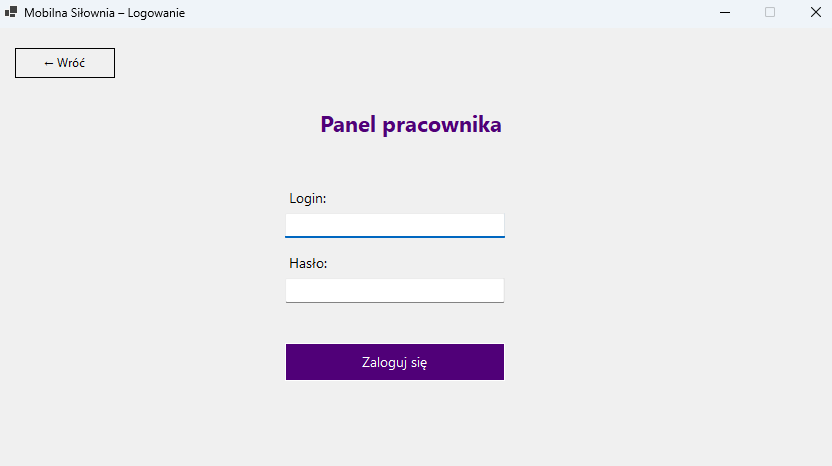
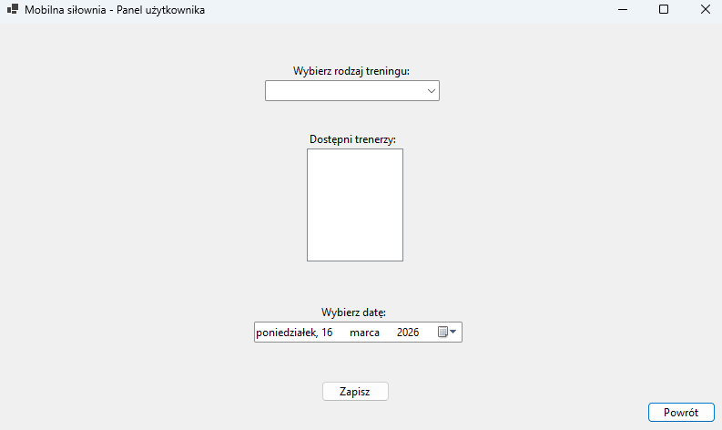
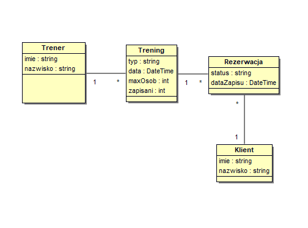
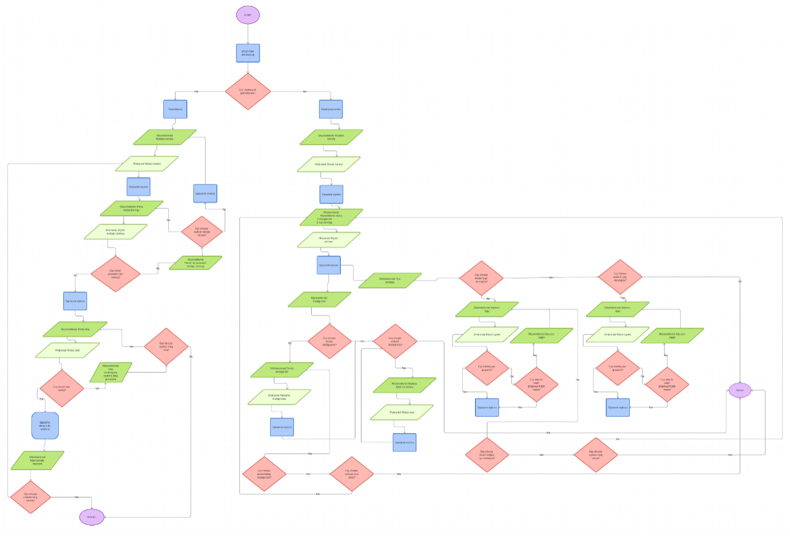

<p align="center">

</p>

# System zapisów na treningi

Aplikacja desktopowa stworzona w języku C# z wykorzystaniem Windows Forms.  
Program umożliwia zarządzanie zapisami na treningi personalne w siłowni.  
Projekt został stworzony jako projekt indywidualny.

---

## Opis aplikacji

Aplikacja umożliwia dwóm typom użytkowników korzystanie z systemu:

- **Klient** – może zapisać się na trening, zmienić termin lub anulować zapis.
- **Pracownik** – może dodawać i usuwać treningi oraz rezerwować sale.

System pozwala na wybór:
- rodzaju treningu (Indywidualny / W parze / Grupowy)
- trenera
- daty i godziny treningu
- sali (dla treningów grupowych)

---

## Funkcjonalności

### Panel klienta
- logowanie do systemu
- przeglądanie dostępnych treningów
- podgląd szczegółów treningu (trener, data, godzina, wolne miejsca)
- zapis na trening z automatyczną kontrolą liczby miejsc
- podgląd własnych zapisów
- zmiana terminu zapisanego treningu
- anulowanie zapisu na trening

### Panel pracownika
- logowanie do systemu
- dodawanie treningów z wyborem typu, daty i godziny
- rezerwacja sali dla treningów grupowych z kontrolą konfliktów
- podgląd własnego harmonogramu
- usuwanie zaplanowanych treningów

---

## Technologie

Projekt został stworzony przy użyciu:
- C# (.NET 8)
- Windows Forms
- SQLite (Microsoft.Data.Sqlite)
- Visual Studio 2022

---

## Jak uruchomić projekt

### Wersja developerska
1. Sklonuj repozytorium.
2. Otwórz plik `Projekt_silka.slnx` w **Visual Studio**.
3. W terminalu zainstaluj pakiet SQLite:
   ```
   dotnet add package Microsoft.Data.Sqlite
   ```
4. Wciśnij **F5**.

### Wersja .exe (bez instalacji)
1. W terminalu uruchom:
   ```
   dotnet publish -c Release -r win-x64 --self-contained true -p:PublishSingleFile=true
   ```
2. Gotowy plik znajdziesz w:
   ```
   bin\Release\net8.0-windows\win-x64\publish\Projekt_silka.exe
   ```
3. Skopiuj plik `.exe` na dowolny komputer z Windows — nie wymaga instalacji.

---

## Struktura projektu

```
Projekt_silka/
│
├── Start.cs                  # Ekran startowy (wybór panelu)
├── Start.Designer.cs
├── LoginForm.cs              # Formularz logowania
├── ClientForm.cs             # Panel klienta
├── ClientForm.Designer.cs
├── EmployeeForm.cs           # Panel pracownika
├── EmployeeForm.Designer.cs
├── Database.cs               # Warstwa danych (SQLite)
│
└── Projekt_silka.csproj
```

---

## Konta demonstracyjne

Przy pierwszym uruchomieniu aplikacja automatycznie tworzy konta:

| Rola | Login | Hasło |
|------|-------|-------|
| Pracownik | `anna` | `1234` |
| Pracownik | `jan` | `1234` |
| Klient | `piotr` | `1234` |
| Klient | `marta` | `1234` |

---

## Baza danych

Dane są przechowywane lokalnie w bazie SQLite tworzonej automatycznie przy pierwszym uruchomieniu:
```
%AppData%\ProjektSilka\data.db
```

---

## Autor

Projekt wykonany w ramach pracy indywidualnej na studia:  
**Justyna Jończyk**

---

## Zrzuty ekranu

### Menu startowe


### Panel logowania klienta


### Panel logowania pracownika


### Panel klienta


### Panel pracownika


### Diagram UML


### Schemat blokowy aplikacji


---

## Zrealizowane funkcjonalności

1. ✅ Połączenie wpisu dostępności z faktycznym zapisem klienta na trening.
2. ✅ Dodanie możliwości logowania (SQLite).
3. ✅ Dodanie funkcjonalności zmiany na zapisany już termin.
4. ✅ Stworzenie możliwości podglądu grafiku pracowników.
5. ✅ Funkcjonalność zapisywania danych po zamknięciu aplikacji.
6. ✅ Poprawienie interfejsu użytkownika.
7. ✅ Dodanie wyboru godziny treningu.
8. ✅ Możliwość anulowania zapisu na trening przez klienta.
9. ✅ Automatyczne kontrolowanie ilości zapisanych osób na treningi.
10. ✅ Rezerwacja sali dla treningów grupowych z kontrolą konfliktów.

## Plany na przyszłość

- Hashowanie haseł użytkowników.
- Rejestracja nowych klientów z poziomu aplikacji.
- Powiadomienia o nadchodzących treningach.
- Płatności online.
- Wersja mobilna.
