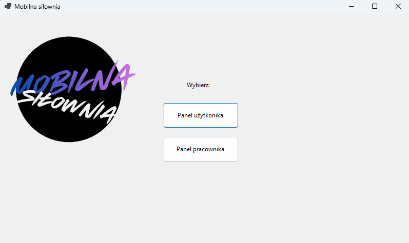
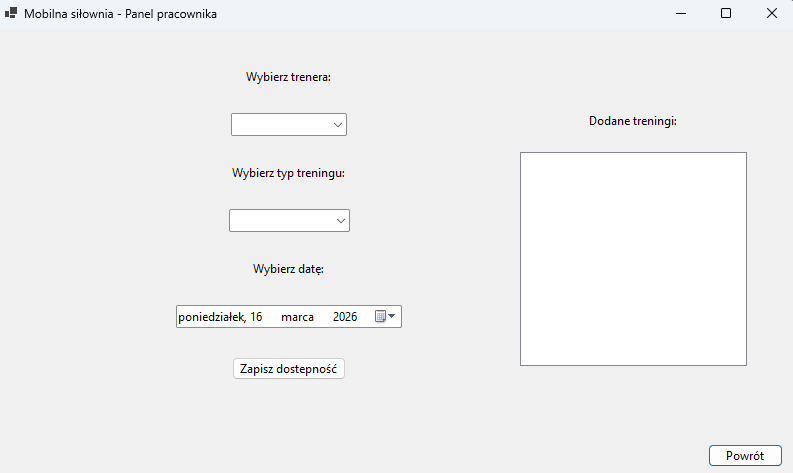

# System zapisów na treningi

Aplikacja desktopowa stworzona w języku C# z wykorzystaniem Windows Forms.  
Program umożliwia zarządzanie zapisami na treningi personalne w siłowni.

Projekt został stworzony jako projekt indywidualny.

---

## Opis aplikacji

Aplikacja umożliwia dwóm typom użytkowników korzystanie z systemu:

- **Klient** – może zapisać się na trening.
- **Pracownik** – może dodawać dostępność trenerów.

System pozwala na wybór:

- rodzaju treningu
- trenera
- daty treningu

---

## Funkcjonalności

### Panel klienta
- wybór rodzaju treningu
- wyświetlenie dostępnych trenerów
- wybór daty treningu
- zapis na trening

### Panel pracownika
- wybór trenera
- określenie typu treningu
- wybór daty
- dodanie dostępności treningu

---

## Technologie

Projekt został stworzony przy użyciu:

- C#
- Windows Forms
- .NET
- Visual Studio

---

## Jak uruchomić projekt

1. Sklonuj repozytorium.
2. Otwórz plik: projekt_silka.sln w **Visual Studio**.
3. Wciśnij F5.

---

## Struktura projektu

Projekt_silka/
│

├── Start.cs

├── ClientForm.cs

├── EmployeeForm.cs

│

└── Projekt_silka.csproj

---

## Autor

Projekt wykonany w ramach pracy indywidualnej na studia:

**Justyna Jończyk**

## Zrzuty ekranu

### Menu startowe

### Panel klienta

### Panel pracownika

---

## Plany na przyszłość

1. Połączenie wpisu dostępności z faktycznym zapisem klienta na trening.
2. Dodanie możliwości logowania.
3. Dodanie funkcjonalności zmiany na zapisany już termin.
4. Stworzenie możliwości podglądu grafiku pracowników.
5. Funkcjonalność zapisywanie danych po zamknięciu aplikacji.
6. Poprawienie interface'u użytkownika.
7. Dodanie wyboru godziny treningu.
8. Możliwość anulowania zapisu na trening przez klienta.
9. Automatyczne kontrolowanie ilości zapisanych osób na treningi.
